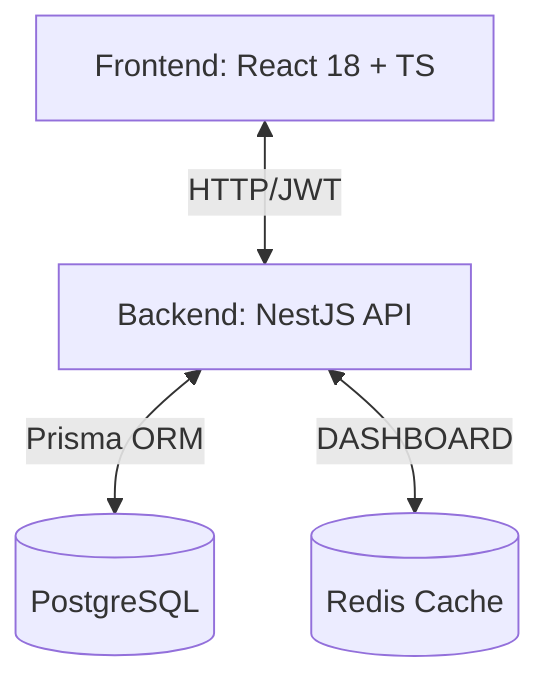

# 🚀 KuriPay — Plataforma de Pagos y Trading Cripto Institucional

**KuriPay** es una plataforma Full-Stack de grado producción que conecta el sistema financiero tradicional (Fiat) con el ecosistema Web3. Centraliza el trading, los pagos vía Lightning Network y herramientas de cumplimiento normativo en una interfaz profesional de alto rendimiento.

> **Stack:** React 18 + TypeScript · NestJS · Prisma + PostgreSQL · Redis · Tailwind CSS · JWT Auth

---

## 🌐 Mapeo de Rutas

| URL | Descripción |
|-----|-------------|
| `/` | Landing Page Pública |
| `/login` | Inicio de Sesión (JWT) |
| `/register` | Registro de nuevos usuarios |
| `/app` | Dashboard de Trading (Protegido) |
| `/app/payments` | Terminal Punto de Venta / QR (Protegido) |
| `/app/transactions` | Historial de Transacciones (Protegido) |
| `/app/compliance` | Panel de Cumplimiento & KYT (Protegido) |
| `/app/settings` | Configuración de Usuario (Protegido) |

---

## 🏗️ Arquitectura del Sistema



---

## 🧩 Modelo de Circulación Económica

El sistema opera bajo un modelo de tres roles con flujos específicos de dinero (Fiat) y activos (Cripto):

### 1. 👤 El Consumidor
- **Compra/Venta**: Puede comprar cripto con dinero real y vender sus criptos únicamente a los **Transaccionadores**.
- **Gasto**: Puede gastar sus criptos exclusivamente en los **Locales**.
- **Objetivo**: Usuario final que utiliza el sistema para ahorro e intercambio de bienes.

### 2. ⚡ El Transaccionador (Agente de Liquidez)
- **Compra**: Adquiere cripto con dinero real de otros Transaccionadores, Consumidores y Locales.
- **Venta**: Vende cripto por dinero real a otros Transaccionadores y Consumidores.
- **Objetivo**: Es el puente de liquidez que permite la entrada y salida de capital (Fiat <-> Cripto) en el sistema.

### 3. 🏪 El Local (Comercio o Servicio)
- **Gasto**: Puede pagar a otros Locales (B2B) usando cripto.
- **Venta**: Solo puede vender sus criptos por dinero real a los **Transaccionadores**.
- **Objetivo**: Punto de aceptación de pagos que recircula el valor dentro del ecosistema empresarial o liquida sus ganancias.

---

## 🕹️ Guía de Funcionalidades: ¿Para qué sirve cada botón?

### 📈 Terminal de Trading (`/app`)

El motor de intercambio principal de la plataforma.

#### Ticker Header
Muestra el precio en vivo de BTC/USD, el cambio en 24h, máximos/mínimos y volúmenes institucionales.

#### Tipos de Órdenes
- **`Limit`** (Límite): Tú defines el precio. La orden se ejecuta solo si el mercado llega a ese punto.
- **`Market`** (Mercado): Compra/vende instantáneamente al mejor precio disponible.
- **`Stop-limit`** (Parada): Activa una orden límite cuando el precio toca un umbral de "disparo".

#### Panel de Operación (TradePanel)
- **`Comprar BTC`**: Envía una solicitud de compra. Debita USD y acredita BTC.
- **`Vender BTC`**: Envía una solicitud de venta. Debita BTC y acredita USD.
- **`Deslizador %`**: Llena automáticamente la cantidad usando el 25%, 50%, 75% o 100% de tu saldo disponible.

---

### 📱 Terminal POS y Pagos QR (`/app/payments`)

Diseñado para que los **Locales** acepten pagos cripto de forma física o digital.

#### ¿Cómo se genera el código QR?
1. **Configuración**: El comercio ingresa el monto (en USD, SATS o BTC).
2. **Conversión**: El sistema convierte automáticamente:
   - `1 USD → 1,587 SATS` (tasa fija de ejemplo).
3. **Petición al Backend**: Al presionar **`Generar QR`**, se envía un `POST /payments/create`.
4. **Generación de Invoice**: El servidor genera una factura **BOLT-11 de Lightning Network** (un string largo que empieza con `lnbc...`).
5. **Renderizado**: El componente `QRPaymentCard` toma ese string y lo convierte en un código QR escaneable por cualquier billetera (Strike, Muun, Phoenix, etc.).

#### Confirmación en Tiempo Real
Una vez generado el QR, el sistema realiza una consulta (**polling**) cada 3 segundos al endpoint `GET /payments/{id}/status`. Si el pago se detecta en el nodo, la terminal avanza automáticamente a la pantalla de **Recibo**.

---

### 🛡️ Cumplimiento y Seguridad (`/app/compliance`)

#### KYT (Know Your Transaction)
Analiza cada transacción entrante. Si una billetera es sospechosa, el sistema marca el riesgo como **Medio** o **Alto** (en rojo).

#### ZK-Proof (Prueba de Inocencia)
Si un pago es bloqueado, el usuario puede generar una **Prueba de Conocimiento Cero (Zero-Knowledge Proof)**. Esto genera un certificado criptográfico que demuestra el origen lícito de los fondos **sin revelar su identidad privada** ni datos sensibles a terceros.

---

## 📁 Estructura del Proyecto

```
src/
 ├─ api/                 # Cliente Axios con interceptores JWT
 ├─ components/
 ├─ features/
 │   ├─ auth/            # Registro, Login y Almacén de Sesión
 │   ├─ compliance/      # KYT y Pruebas ZK
 │   ├─ consumer/        # Dashboard de Consumidor
 │   ├─ landing/         # Landing Page moderna
 │   ├─ liquidity/       # Dashboard de Transaccionador
 │   ├─ merchant/        # Dashboard de Locales
 │   ├─ payments/        # Terminal POS y lógica de QR
 │   └─ shared/          # Mapa de flujo del sistema
 ├─ layouts/             # Envoltorios de navegación (Sidebar/Topbar)
 ├─ routes/              # Manejo de rutas y seguridad
 └─ types/               # Definiciones de TypeScript
```

---

## 🛠️ Instalación y Uso

### Requisitos
- Node.js `18+`
- npm o yarn
- PostgreSQL + Redis (Backend)

### Pasos
1. Clonar el repositorio.
2. Ejecutar `npm install`.
3. Configurar `.env` con la URL de la API.
4. Ejecutar `npm run dev` para iniciar el servidor de desarrollo en `http://localhost:5173`.

---

## 🛡️ Estándares del Proyecto

- **Seguridad**: Máscara automática de claves secretas (`sk_test_••••`).
- **Rendimiento**: Interfaz optimizada para pantallas desde 1024px hasta 4K.
- **Tipado Estricto**: 100% de los datos estructurados con interfaces de TS.
- **Código Limpio**: Auditoría completa realizada para eliminar archivos huérfanos y lógica duplicada.
