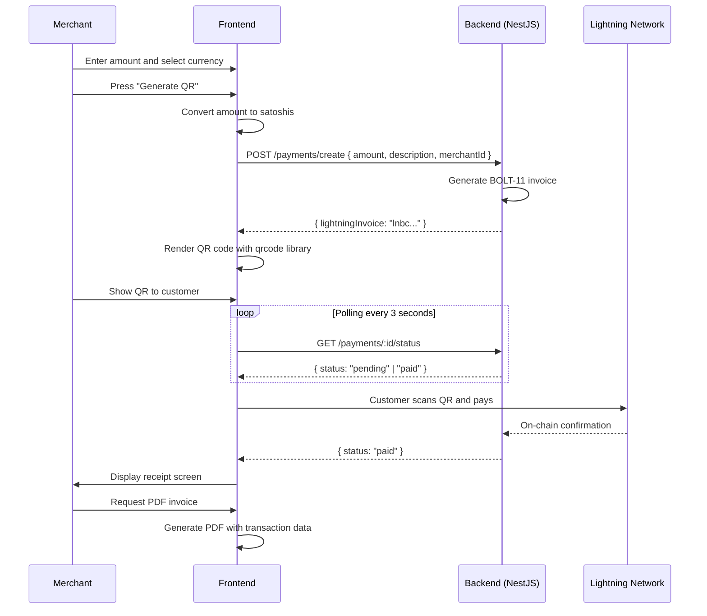

# KuriPay — Enterprise Crypto Payments and Trading Platform

**KuriPay** is a production-grade Full-Stack platform that bridges traditional (Fiat) finance with the Web3 ecosystem. It unifies crypto trading, Lightning Network payments, and regulatory compliance tools in a single professional interface.

> **Stack:** React 19 + TypeScript · NestJS · Prisma + PostgreSQL · Redis · Tailwind CSS · JWT Auth

**Live demo:** [https://hackaton-frontend-pearl.vercel.app](https://hackaton-frontend-pearl.vercel.app)

---

## Table of Contents

1. [Overview](#overview)
2. [Project Architecture](#project-architecture)
3. [Folder Structure](#folder-structure)
4. [User Roles](#user-roles)
5. [Routes and Role-Based Access](#routes-and-role-based-access)
6. [Core Features](#core-features)
7. [Full System Flow](#full-system-flow)
8. [Transaction, QR, and PDF Invoice Flow](#transaction-qr-and-pdf-invoice-flow)
9. [Frontend to Backend Connection](#frontend-to-backend-connection)
10. [Environment Variables](#environment-variables)
11. [Installation and Local Development](#installation-and-local-development)
12. [Production Deployment](#production-deployment)
13. [Key API Endpoints](#key-api-endpoints)
14. [Demo Accounts for Evaluation](#demo-accounts-for-evaluation)

---

## Overview

KuriPay addresses the fragmentation of the crypto payment ecosystem in Latin America. Merchants can accept Bitcoin (Lightning Network) payments from a web-based POS terminal without any specialized hardware. Consumers can buy, sell, and trade crypto within the same system. Liquidity agents monitor compliance and manage the flow of liquidity between all participants.

### System Pillars

| Pillar | Description |
|--------|-------------|
| **Trading** | BTC/USDT exchange terminal with Limit, Market, and Stop-Limit order types |
| **QR Payments** | POS terminal that generates Lightning Network invoices (BOLT-11) and scannable QR codes |
| **Compliance (KYT)** | Per-transaction risk analysis and Zero-Knowledge Proof (ZK-Proof) generation |
| **Multi-role** | Interface that automatically adapts to the authenticated user's role |

---

## Project Architecture

```
+-----------------------------------------------------------+
|                    CLIENT (Browser)                       |
|         React 19 + TypeScript + Vite + Tailwind           |
|                                                           |
|  +----------+  +----------+  +----------+  +----------+  |
|  | Trading  |  | Payments |  |Compliance|  |  Auth    |  |
|  | Feature  |  | Feature  |  | Feature  |  |  Store   |  |
|  +----+-----+  +----+-----+  +----+-----+  +----+-----+  |
|       +---------------+---------------+---------+         |
|                       Axios + JWT                         |
+-------------------------------+---------------------------+
                                | HTTPS / REST
+-------------------------------v---------------------------+
|                    BACKEND (NestJS)                       |
|         Modular REST API · JWT Guards · Swagger           |
|                                                           |
|  +----------+  +----------+  +----------+  +----------+  |
|  |  Auth    |  | Payments |  |Compliance|  | Wallets  |  |
|  | Module   |  | Module   |  | Module   |  | Module   |  |
|  +----+-----+  +----+-----+  +----+-----+  +----+-----+  |
|       +---------------+-------+-------------+            |
|                       Prisma ORM                         |
+-------------------------------+---------------------------+
                                |
                 +--------------+--------------+
                 |                             |
        +--------v--------+         +----------v-----+
        |  PostgreSQL DB  |         |  Redis Cache   |
        +-----------------+         +----------------+
```

### Technology Stack

| Layer | Technology | Version |
|-------|------------|---------|
| UI Framework | React | 19 |
| Language | TypeScript | ~5.9 |
| Bundler | Vite | 8 |
| Styles | Tailwind CSS + CSS Variables | 3.4 |
| Global State | Zustand | 5 |
| Routing | React Router DOM | 7 |
| HTTP / Auth | Axios with JWT interceptors | 1.x |
| Charts | Recharts | 3 |
| Animations | Framer Motion | 12 |
| QR Generation | `qrcode` (npm) | 1.5 |
| Backend | NestJS (modular REST API) | — |
| ORM | Prisma → PostgreSQL | — |
| Cache / Queues | Redis | — |
| Deployment | Vercel (Frontend) | — |

---

## Folder Structure

```
src/
├── api/
│   └── apiClient.ts          # Global Axios instance with JWT interceptors
├── assets/                   # Static images, SVGs, and icons
├── components/
│   ├── auth/                 # ProtectedRoute (route guard component)
│   ├── common/               # Generic reusable components
│   ├── layout/               # Sidebar, Header, DashboardLayout
│   └── ui/                   # Buttons, inputs, cards, modals
├── features/
│   ├── auth/                 # Login, Register, authStore (Zustand)
│   ├── compliance/           # KYT panel and ZK-Proof generation
│   ├── consumer/             # Consumer dashboard
│   ├── landing/              # Public landing page
│   ├── liquidity/            # Liquidity agent view
│   ├── merchant/             # Merchant dashboard
│   ├── payments/             # POS terminal, QR generation, PDF invoice
│   ├── settings/             # Account and merchant terminal settings
│   ├── shared/               # Hooks and components shared across features
│   ├── trading/              # Trading terminal and transaction history
│   └── wallets/              # Wallet balance management
├── layouts/
│   └── DashboardLayout.tsx   # Main layout for the authenticated app shell
├── routes/
│   └── AppRoutes.tsx         # Central route definitions for the entire app
├── types/
│   └── index.ts              # Global TypeScript domain types
└── utils/
    └── cn.ts                 # Utility for merging Tailwind class names
```

---

## User Roles

The interface automatically adapts to the authenticated user's role:

| Role | Internal identifier | Primary access |
|------|---------------------|----------------|
| **Consumer** | `consumer` | Trading, transaction history, settings |
| **Merchant** | `merchant` | POS terminal, QR generation, trading, history |
| **Transactor / Agent** | `transaccionador` | Trading, compliance panel, liquidity management |
| **Admin** | `admin` | Full access to all panels |

Role mapping from the backend (`roles: string[]`) is handled in `authStore.ts` through the `mapBackendRole` function.

---

## Routes and Role-Based Access

| Route | Component | Access |
|-------|-----------|--------|
| `/` | `LandingPage` | Public |
| `/login` | `Login` | Public |
| `/register` | `Register` | Public |
| `/pay/:id` | `PaymentLinkPage` | Public (shareable payment link) |
| `/invoice/:id` | `InvoicePage` | Public (invoice receipt) |
| `/app` | `Dashboard` | All authenticated roles |
| `/app/payments` | `Payments` (POS) | `merchant`, `admin` |
| `/app/transactions` | `Transactions` | All authenticated roles |
| `/app/compliance` | `Compliance` | `transaccionador`, `admin` |
| `/app/settings` | `Settings` | All authenticated roles |

Protected routes are managed by the `ProtectedRoute` component, which verifies the authentication state via `authStore` (Zustand) and redirects to `/login` if there is no active session. Role-based access is enforced through the `allowedRoles` prop.

---

## Core Features

### Trading Terminal (`/app`)

The main exchange engine of the platform.

- **TickerHeader:** live BTC/USDT price, 24h change, highs/lows, and volume in real time.
- **Order types:**
  - `Limit` — set a target price; the order executes only when the market reaches that price.
  - `Market` — executes immediately at the current market price.
  - `Stop-Limit` — triggers a Limit order once the price reaches a defined "stop" threshold.
- **Candlestick chart** with simulated historical data (Recharts).
- **MockFaucet:** button to add test funds (USD or BTC) to the local wallet to evaluate the full flow without real funds.

---

### Point of Sale (POS) Terminal (`/app/payments`)

Designed for merchants to accept crypto payments in physical or digital stores.

#### Step 1 — Configure the charge
1. Enter the **amount** to charge.
2. Select the **currency** (SATS / USD / BTC). Conversion to satoshis happens automatically in the frontend using the real-time exchange rate.
3. Select the **merchant node** that will receive the payment (`merchantId`).
4. Optionally add an **internal note** or sale description.

#### Step 2 — Generate the QR
When the user presses **"Generate Terminal QR"**, the system:
1. Converts the entered amount to satoshis.
2. Sends `POST /payments/create` to the backend with `{ amount, description, merchantId, currency: 'BTC' }`.
3. The backend generates a **BOLT-11 invoice** (Lightning Network invoice), a string starting with `lnbc...`.
4. The frontend receives the `lightningInvoice` and renders it as a **QR code** using the `qrcode` library.
5. The customer scans the QR with any compatible Lightning wallet (Strike, Muun, Phoenix, etc.) and completes the payment.

#### Step 3 — Payment monitoring
Once the QR is displayed, the system **polls** `GET /payments/:id/status` every 3 seconds. When the backend confirms the payment (`status: "paid"`), the screen automatically transitions to the transaction receipt.

#### Step 4 — PDF Invoice
From the receipt screen, the merchant can generate and download a **PDF invoice** containing full transaction details (amount, date, order ID, description, and merchant information).

---

### Compliance Panel (`/app/compliance`)

#### Tab 1 — KYT (Know Your Transaction)
Classifies each incoming transaction by risk level: **Low (green)**, **Medium (yellow)**, and **High (red)**. High-risk payments are flagged and can be blocked.

#### Tab 2 — Proof of Innocence (PoI)
If a transaction is blocked due to risk:
1. The agent clicks **"Generate ZK-Proof"**.
2. The system generates a cryptographic **Zero-Knowledge Proof**.
3. This proof allows the merchant to demonstrate the legitimacy of their funds **without revealing any private information**.

---

### Settings (`/app/settings`)

- User profile management.
- Merchant terminal (node) configuration.
- Account preferences.

---

## Full System Flow

```
User visits /
       |
       v
Public page (LandingPage)
       |
       +---> /login  --> authStore.login() --> POST /auth/login
       |                └--> JWT stored in localStorage
       |
       +---> /register --> authStore.register() --> POST /auth/register
       |
       └---> /app (ProtectedRoute checks token)
                |
                +-- Consumer ---------> Trading Dashboard + History
                |
                +-- Merchant ---------> Trading Dashboard + POS Terminal
                |                              |
                |                              +--> Generates QR (BOLT-11)
                |                              +--> Monitors payment (polling)
                |                              +--> Shows receipt + PDF
                |
                +-- Transactor -------> Trading Dashboard + Compliance (KYT/ZK)
                |
                └-- Admin ------------> Full access to all panels
```

---

## Transaction, QR, and PDF Invoice Flow



---

## Frontend to Backend Connection

### HTTP Client (`src/api/apiClient.ts`)

A single **Axios** instance is used, with the base URL configured from the `VITE_API_URL` environment variable.

**Request interceptor:** automatically attaches the `accessToken` from `localStorage` as an `Authorization: Bearer <token>` header on every outgoing request.

**Response interceptor:**
1. Unwraps the backend response envelope (which wraps success responses as `{ success: true, data: ... }`) to deliver the `data` payload directly to service functions.
2. On a `401 Unauthorized` response, automatically attempts to refresh the token via `POST /auth/refresh`.
3. If the refresh fails, clears localStorage and redirects to `/login`.

### Services by Feature

| Service | File | Responsibility |
|---------|------|----------------|
| `authStore` | `features/auth/store/authStore.ts` | Login, register, logout, session refresh |
| `walletsService` | `features/wallets/api/walletsService.ts` | Wallet balance queries and updates |
| `paymentService` | `features/payments/api/paymentService.ts` | Create invoices, check status, simulate payments |
| `dashboardService` | `features/trading/api/dashboardService.ts` | Dashboard metrics and recent transactions |
| `complianceService` | `features/compliance/api/complianceService.ts` | KYT risk analysis and ZK-Proof generation |
| `liquidityService` | `features/liquidity/api/liquidityService.ts` | Liquidity management for agents |
| `merchantsService` | `features/settings/api/merchantsService.ts` | CRUD for merchant terminals/nodes |

### Authentication and Global State

Authentication state is managed by **Zustand** (`useAuthStore`). On app startup, `initAuth()` checks whether an `accessToken` exists in `localStorage` and, if valid, calls `GET /auth/me` to reconstruct the user object. The session persists across browser reloads.

---

## Environment Variables

Create a `.env` file in the project root (or copy from `.env.example`) with the following variables:

```env
# Backend API base URL (required)
VITE_API_URL=http://localhost:3000/api/v1

# Public frontend URL (used for shareable payment links)
VITE_PUBLIC_APP_URL=https://hackaton-frontend-pearl.vercel.app

# Enable demo payment fallback mode (useful in staging without a backend)
VITE_ENABLE_DEMO_PAYMENT_FALLBACK=false

# GenLayer RPC URL (for future ZK on-chain functionality)
VITE_GENLAYER_RPC_URL=https://testnet.genlayer.com

# Stripe public key (for future fiat payment integration)
VITE_STRIPE_PUBLIC_KEY=your_public_key_here

# Clover app ID (for future physical POS integration)
VITE_CLOVER_APP_ID=your_app_id_here
```

> **Never commit the `.env` file to the repository.** Use `.env.example` as the public template.

---

## Installation and Local Development

### Prerequisites

- **Node.js** `18+` (recommended: 20 LTS)
- **npm** `9+` or **yarn** `1.x`
- Backend running locally or accessible on the network (see the `Hackaton-Backend` repository)

### Steps

```bash
# 1. Clone the repository
git clone https://github.com/your-username/Hackaton-frontend.git
cd Hackaton-frontend

# 2. Install dependencies
npm install

# 3. Configure environment variables
cp .env.example .env
# Edit .env: set VITE_API_URL to the local backend URL

# 4. Start the development server
npm run dev
# Available at: http://localhost:5173
```

### Available Scripts

| Command | Description |
|---------|-------------|
| `npm run dev` | Starts the development server with HMR |
| `npm run build` | Compiles TypeScript and generates the production bundle in `/dist` |
| `npm run preview` | Serves the production bundle locally for review |
| `npm run lint` | Runs ESLint across all source code |
| `npm run verify:qr` | QR generation verification script (Node.js) |

---

## Production Deployment

### Vercel (recommended)

This project is configured for automatic deployment on **Vercel**. The `vercel.json` file already includes the rewrite rules required for React Router (SPA routing).

#### Steps to deploy

```bash
# 1. Install Vercel CLI (if not already installed)
npm install -g vercel

# 2. Deploy
vercel --prod
```

Alternatively, connect the repository directly from the Vercel dashboard for continuous deployment on every `git push` to `main`.

#### Environment variables on Vercel

In the Vercel dashboard under **Settings > Environment Variables**, add:

| Variable | Production value |
|----------|-----------------|
| `VITE_API_URL` | Public URL of the deployed backend |
| `VITE_PUBLIC_APP_URL` | The Vercel frontend URL |
| `VITE_ENABLE_DEMO_PAYMENT_FALLBACK` | `false` |

#### Manual production build

```bash
# Generate optimized static files in the /dist folder
npm run build

# Preview the build locally before uploading
npm run preview
```

The `/dist` directory can be served from any CDN or static file server (Nginx, S3, Cloudflare Pages, etc.).

---

## Key API Endpoints

| Method | Endpoint | Description |
|--------|----------|-------------|
| `POST` | `/auth/login` | Authenticates a user and returns `accessToken` + `refreshToken` |
| `POST` | `/auth/register` | Registers a new user by role |
| `GET` | `/auth/me` | Returns the authenticated user's data |
| `POST` | `/auth/refresh` | Renews the `accessToken` using the `refreshToken` |
| `POST` | `/auth/logout` | Invalidates the active user session |
| `GET` | `/wallets/me` | Returns the user's wallets and balances |
| `POST` | `/payments/create` | Creates a Lightning Network invoice (BOLT-11) |
| `GET` | `/payments/:id/status` | Checks the payment status of an invoice |
| `GET` | `/payments/:id` | Returns the full details of an invoice |
| `GET` | `/payments` | Retrieves the user's payment history |
| `GET` | `/transactions` | Paginated transaction history |
| `GET` | `/users/me/metrics` | User dashboard metrics |
| `POST` | `/compliance/proof-of-innocence` | Generates a ZK-Proof for a disputed transaction |
| `GET` | `/merchants` | Lists available merchant terminals |

---

## Demo Accounts for Evaluation

The system includes demo accounts that work even without a running backend, thanks to the fallback mechanism in `authStore`.

| Email | Password | Role |
|-------|----------|------|
| `owner@demo.ec` | `demo1234` | Merchant (POS Terminal) |
| `agent@demo.com` | `demo1234` | Transactor (Liquidity Agent) |
| `consumer@demo.com` | `demo1234` | Consumer (End User) |

> These accounts automatically activate test wallets with simulated balances, allowing a full flow evaluation without real funds.

---

## License

This project was developed as a submission for the Web Crypto Hackathon 2025. All rights reserved.
