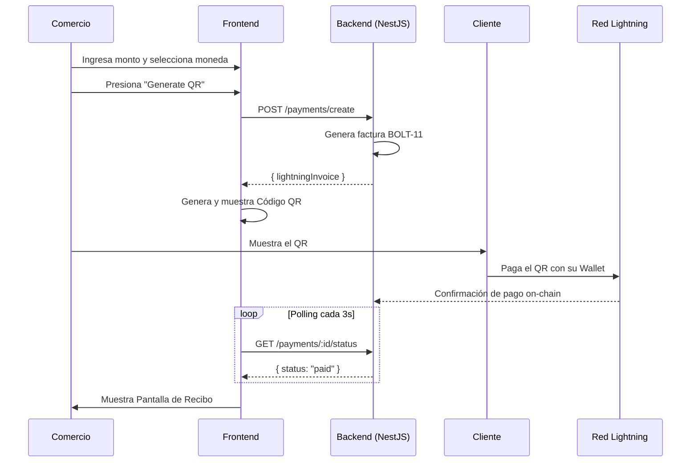

# 🚀 KuriPay — Plataforma Empresarial de Pagos y Trading en Cripto

**KuriPay** es una plataforma Full-Stack de grado de producción que conecta las finanzas tradicionales (Fiat) con el ecosistema Web3. Unifica trading, pagos en la Red Lightning (Lightning Network) y herramientas de cumplimiento en una sola interfaz profesional.

> **Stack:** React 18 + TypeScript · NestJS · Prisma + PostgreSQL · Redis · Tailwind CSS · JWT Auth

---

## 🌐 Rutas del Aplicativo

| URL | Descripción |
|-----|-------------|
| `/` | Página de aterrizaje pública (Landing Page) |
| `/login` | Inicio de sesión (Autenticación JWT) |
| `/register` | Registro de nuevo usuario |
| `/app` | Panel de Trading (protegido) |
| `/app/payments` | Terminal de Punto de Venta / POS (protegido) |
| `/app/transactions` | Historial de transacciones (protegido) |
| `/app/compliance` | Panel de Cumplimiento y KYT (protegido) |
| `/app/settings` | Configuración de usuario (protegido) |

---

## 🏗️ Arquitectura

```
Frontend (React 18 + TS + Vite)
         ↕ HTTP/JWT (Interceptores de Axios)
Backend  (API modular en NestJS)
         ↕ Prisma ORM
Base de Datos (PostgreSQL + Cache en Redis)
```

### Stack Tecnológico

| Capa | Tecnología |
|-------|-----------|
| Framework UI | React 18 + TypeScript |
| Empaquetador | Vite |
| Estilos | Tailwind CSS (paleta navy/slate) |
| Estado | Zustand (sesión de autenticación) |
| Enrutado | React Router DOM v6 |
| HTTP | Axios con auto-refresco de JWT |
| Gráficos | Recharts |
| Backend | NestJS (API REST modular) |
| ORM | Prisma → PostgreSQL |
| Cache | Redis (sesiones y colas) |

---

## 🧩 Roles de Usuario

La interfaz se adapta automáticamente según el rol del usuario que inicia sesión:

| Rol | Acceso |
|------|--------|
| **Consumer** | Panel de trading, historial de órdenes, configuración. |
| **Merchant** | Terminal POS, trading, historial de órdenes. |
| **Liquidity Agent** | Trading, cumplimiento, gestión de órdenes. |
| **Admin** | Acceso total a todos los paneles. |

---

## 🕹️ Guía de Funcionalidades: ¿Qué hace cada botón?

### 📈 Terminal de Trading (`/app`)

El motor de intercambio principal de la plataforma.

#### Barra de Encabezado (TickerHeader)
Muestra el precio en vivo de BTC/USDT, el cambio en 24h, máximos/mínimos y volumen en tiempo real.

#### Tipos de Órdenes
| Opción | Función |
|--------|-------------|
| `Limit` | Estableces un precio específico. La orden solo se ejecuta si el mercado alcanza dicho precio. |
| `Market` | Compra/vende instantáneamente al precio actual de mercado. |
| `Stop-limit` | Un disparador de dos pasos: activa una orden Limit una vez que el precio alcanza un umbral "stop". |

---

### 📱 Terminal Punto de Venta (POS) (`/app/payments`)

Diseñado para que los comercios acepten pagos en cripto en tiendas físicas o digitales.

#### Paso 1 — Configurar el Pago
1. **Monto del Pago:** Ingresa el valor a cobrar.
2. **Selector de Moneda (SATS / USD / BTC):** Cambia la unidad. USD y BTC se convierten automáticamente a SATS internamente.
3. **Nodo del Comercio:** Selecciona qué tienda/ubicación recibe el pago.
4. **ID de Orden:** Identificador único autogenerado.
5. **Nota Interna:** Descripción opcional del cobro.

#### Paso 2 — Cómo se Genera el QR desde la Web
Al presionar el botón **`Generate Terminal QR`**, ocurre lo siguiente:

1. **Conversión:** Si se ingresó en USD o BTC, el frontend lo convierte a SATS usando la tasa de cambio actual.
2. **Llamada a la API:** Se envía una solicitud `POST /payments/create` al backend de NestJS con el monto, descripción e ID del comercio.
3. **Generación del Invoice:** El backend genera una factura de la **Red Lightning (BOLT-11 invoice)**. Esta es una cadena de texto que comienza con `lnbc...`.
4. **Visualización:** El frontend recibe esta factura y la convierte en un **Código QR** usando el componente `QRPaymentCard`. 
5. **Escaneo:** El cliente escanea este QR con cualquier billetera compatible con Lightning (Strike, Muun, Phoenix, etc.).

#### Paso 3 — Monitoreo en Tiempo Real
Una vez que aparece el QR, el sistema consulta (polling) al backend cada 3 segundos para verificar el estado del pago. Si el pago es exitoso, la pantalla cambia automáticamente al recibo.

---

### 🛡️ Panel de Cumplimiento (`/app/compliance`)

#### Tab 1 — `Seguridad · KYT` (Conoce tu Transacción)
Clasifica cada pago entrante por nivel de riesgo (Bajo, Medio, Alto). Los pagos de alto riesgo se marcan en rojo.

#### Tab 2 — `Prueba de Inocencia (PoI)`
Si una transacción es bloqueada por riesgo:
1. Haz clic en **`Generate ZK-Proof`**.
2. El sistema genera una **Prueba de Conocimiento Cero (Zero-Knowledge Proof)** criptográfica. Esto permite al comercio demostrar la legitimidad de sus fondos sin revelar datos privados.

---

## ⚡ Flujo de Pago QR (Secuencia)



---

## 🛠️ Instalación y Configuración

### Requisitos
- Node.js `18+`
- npm o yarn
- PostgreSQL + Redis (para el backend)

### Frontend

```bash
# 1. Instalar dependencias
npm install

# 2. Configurar entorno
cp .env.example .env.local
# Configurar VITE_API_URL=http://localhost:3000/api/v1

# 3. Iniciar servidor de desarrollo
npm run dev
# → http://localhost:5173
```

---

## 🔌 Endpoints Clave de la API

| Método | Endpoint | Descripción |
|--------|----------|-------------|
| `POST` | `/auth/login` | Inicia sesión y devuelve tokens JWT. |
| `POST` | `/payments/create` | Crea una factura de la Red Lightning. |
| `GET` | `/payments/:id/status` | Verifica si una factura ha sido pagada. |
| `POST` | `/compliance/proof-of-innocence` | Genera una prueba ZK para transacciones disputadas. |
